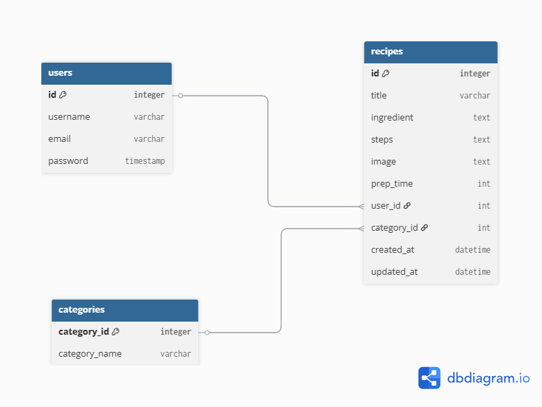

# Capstone-Prject: Recipe Sharing Platform 🍜


## Project Desription
This project is a simple website where users can share their favorite cooking recipes.  
Users can sign up, log in, and add their own recipes with ingredients, steps, and an optional image... etc.
Everyone can also view other users’ recipes and get cooking ideas.  
Each user can edit or delete their own recipes anytime.

## Tech stack
- user registration log in and logout
- CRUD (add, edit, delete ) recipes 
- view all recipes
- in "my recipes" page you can view only your recipes
- Html, css 

## User Stories
1. as a visitor i want to create an account to share my own recipes on the website 
2. user log in and log out to access my own recipes 
3. user add a new recipe and share it with other users
4. user can also edit his own recipes so he can update information or correct mistakes
5. user can delete or remove any of his unwated recipes 
6. visitor view a list of recipes in page in the navbar contains all recipes
7.  visitor view a single recipe with details of that recipe like see ingredients and steps...etc.
8. user can see only his recipes manage and organize them .
9. admin manage all recipes and users to maintain the paltform and remove inappropriate content

## ERD 

## Relationships
I have 3 models  (User, Reciepes , Cateogry )
- One user can have many recipes 
- Each recipe belongs to one user
- each recipe belongs to one categor
User (1) ----< (many) Recipe (many) >---- (1) Category

## Installation Guide
1- clone this repository
```bash 
git clone https://github.com/sawsansalameh222/Capstone-Project.git
```
2-Navigate to the project directory
 ```bash
cd Capstone-Project 
```

3- Install dependencies using pipenv
 ```bash 
pipenv install 
``` 
4- Activate the virtual environment
```bash 
pipenv shell 
``` 
5- Apply database migrations
``` bash
python manage.py makemigrations
python manage.py migrate
```
5- Run the server
```bash
python manage.py runserver
```
## Key Features Implemented
- 🍽️ Add New Recipes – Users can easily add new recipes with a name, ingredients, preparation steps, and an image.

-  Upload Recipe Images – Supports image uploads using the Pillow library.
-  Rate Recipes – Users can rate recipes using a star-based rating system.
-  View All Recipes – Display all added recipes in a clean and responsive card layout.
-  Recipe Details Page – View full recipe information, including preparation time and ingredients.
-  User-Friendly Interface – Simple and visually appealing UI built with HTML, CSS, and Django templates.
-  Database Integration – Recipes and ratings are stored securely in a SQLite database.
-  Django Admin Panel – Admins can manage recipes directly from Django’s built-in admin interface.

## Challenges Encountered 
- Card Layout and Alignment Problems
Recipe cards appeared stacked or misaligned on the page, especially when displayed in a grid.
Solution: I used Flexbox and CSS properties like justify-content: center; and align-items: center; to align cards properly and ensure responsiveness across different screen sizes.

- Switching from venv to pipenv
the project required using pipenv shell. When I switched, I encountered path issues because the environment changed.
Solution: With help from Purvi, I verified that all files were in the correct locations and adjusted paths accordingly. After that, the project ran smoothly under pipenv.

## Future Enhancements
- Search and Filter Recipes by Category
As a visitor/user, I want to search or filter recipes by category so I can find the type of dish I want quickly.
- Comments and Reviews
Allow users to leave comments and reviews for recipes to make the platform more interactive.
- Like and Save Recipes
Allow users to like their favorite recipes and save them to a personal list for easy access later.
- enhance User Interface , and work more on CSS